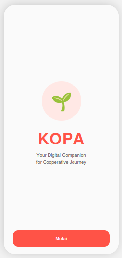
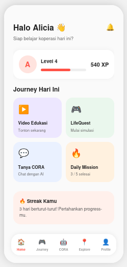
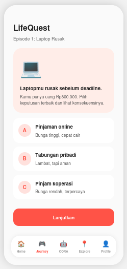
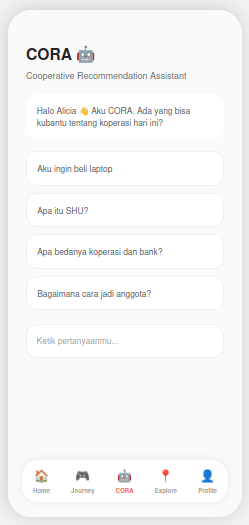
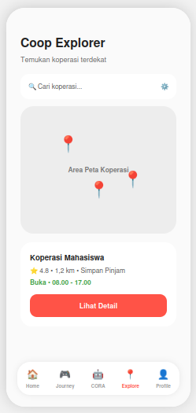
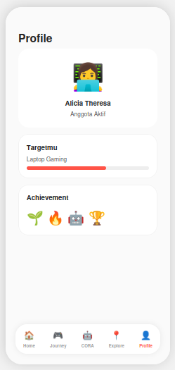

# 🌾 KOPA

<h1 align="center">Knowledge & Opportunity Platform for Cooperative Advancement</h1>

<h3 align="center">
AI Digital Companion for Cooperative Journey
</h3>

<p align="center">


</p>

---

# 🚀 Overview

KOPA (**Knowledge & Opportunity Platform for Cooperative Advancement**) adalah AI Digital Companion yang membantu Generasi Z mengenal, memahami, dan memanfaatkan koperasi melalui pengalaman belajar yang personal, interaktif, dan relevan.

Berbeda dengan platform edukasi konvensional, KOPA tidak hanya menyajikan materi, tetapi juga mendampingi pengguna melalui AI, simulasi finansial, gamifikasi, serta rekomendasi koperasi berdasarkan kebutuhan dan tujuan finansial masing-masing pengguna.

Project ini dikembangkan sebagai proposal pada **Hackathon Digital Cooperatives Expo 2026** yang diselenggarakan oleh **Kementerian Koperasi Republik Indonesia**.

---

# 📱 Prototype Preview

> Prototype saat ini masih dalam tahap pengembangan.

| Splash | Home | Journey |
|:------:|:----:|:----:|
|  |  |  |

| CORA | Explorer | Profile |
|:---------:|:--------:|:-------:|
|  |  |  |

---

# 🎯 Problem Statement

Berdasarkan survei terhadap **43 responden**, mayoritas merupakan mahasiswa berusia **18–25 tahun**.

## Temuan utama

| Insight | Persentase |
|---------|-----------:|
| Kurang memahami manfaat koperasi | **51.2%** |
| Lebih memilih layanan digital lain | **44.2%** |
| Informasi koperasi kurang menarik | **41.9%** |

Mayoritas responden juga menyatakan lebih sering belajar melalui:

- TikTok
- Instagram
- YouTube

serta menginginkan media pembelajaran berupa:

- AI Assistant
- Video singkat
- Simulasi
- Gamifikasi

Temuan tersebut menunjukkan bahwa tantangan utama bukan terletak pada koperasi itu sendiri, melainkan pada bagaimana koperasi diperkenalkan kepada Generasi Z.

---

# 💡 Our Solution

KOPA menghadirkan AI Digital Companion yang mempersonalisasi pengalaman belajar koperasi melalui:

- 🤖 AI Recommendation
- 🎯 Personalized Learning Journey
- 🎮 Financial Simulation
- 🏆 Gamification
- 🗺️ Cooperative Discovery

Dengan demikian koperasi tidak lagi dipelajari sebagai teori, tetapi menjadi bagian dari perjalanan finansial pengguna.

---

# ✨ Main Features

## 🤖 CORA

**Cooperative Recommendation Assistant**

AI Companion berbasis Large Language Model (LLM) yang membantu pengguna:

- memahami koperasi
- menjawab pertanyaan
- memberikan rekomendasi
- menyusun learning journey

---

## 🎯 Personalized Learning Journey

Setiap pengguna memiliki jalur belajar yang berbeda berdasarkan:

- umur
- status
- tujuan finansial
- aktivitas
- progress belajar

---

## 🎮 LifeQuest

Financial Simulation berbasis kehidupan nyata.

Contoh skenario:

- membeli laptop
- menabung
- modal usaha
- dana darurat

Pengguna dapat melihat konsekuensi dari setiap keputusan finansial.

---

## 📱 Micro Learning

Konten edukasi koperasi dalam bentuk video pendek yang mengikuti kebiasaan konsumsi konten Generasi Z.

---

## 🏆 Gamification

KOPA menggunakan sistem gamifikasi untuk meningkatkan engagement.

Fitur:

- XP
- Level
- Badge
- Daily Challenge
- Achievement
- Leaderboard

---

## 🗺️ Coop Explorer

Membantu pengguna menemukan:

- koperasi
- produk
- layanan
- kegiatan
- event

berdasarkan lokasi pengguna.

---

# 🏗️ System Architecture

> Diagram arsitektur akan ditambahkan pada folder `docs/architecture.png`


---

# 🛠️ Tech Stack

| Layer | Technology |
|--------|------------|
| Mobile Framework | React Native (Expo) |
| Programming Language | TypeScript |
| Backend | Node.js + Express *(Planned)* |
| Database | Firebase Firestore *(Planned)* |
| Authentication | Firebase Authentication |
| AI | OpenAI API / Gemini API |
| Maps | Google Maps API |

---

# 🗺️ Development Roadmap

## ✅ Phase 1 — Research & Validation

- [x] Problem Identification
- [x] User Survey (43 Respondents)
- [x] User Needs Analysis
- [x] Problem Validation
- [x] MVP Planning
- [x] UI Prototype
- [x] GitHub Repository

---

## 🚧 Phase 2 — MVP Development

- [x] React Native Setup
- [x] Initial UI Prototype
- [ ] Firebase Authentication
- [ ] Firestore Integration
- [ ] LifeQuest Interaction
- [ ] Gamification System
- [ ] Responsive Mobile UI

---

## 🔜 Phase 3 — AI Personalization

- [ ] CORA AI Integration
- [ ] Prompt Engineering
- [ ] Personalized Recommendation
- [ ] Personalized Learning Journey
- [ ] AI Financial Companion

---

## 🚀 Phase 4 — Cooperative Ecosystem

- [ ] Coop Explorer
- [ ] Google Maps Integration
- [ ] Cooperative Database
- [ ] Cooperative Recommendation Engine
- [ ] Cooperative Events

---

## 🌱 Phase 5 — Public Release

- [ ] User Testing
- [ ] UI/UX Improvement
- [ ] Performance Optimization
- [ ] Security Enhancement
- [ ] SHU Calculator
- [ ] Cooperative Marketplace
- [ ] Public Release

---

# 📂 Repository Structure

```text
KOPA
│
├── backend/
│
├── docs/
│   ├── architecture.png
│   ├── survey-summary.pdf
│   └── screenshots/
│
├── frontend/
│   ├── src/
│   ├── assets/
│   ├── package.json
│   ├── app.json
│   └── tsconfig.json
│
├── prototype/
│
└── README.md
```

---

## 👥 Team

| Name | Role |
|------|------|
| Alicia Theresa | Product Owner • Frontend Developer • UI/UX Designer |
| Nama Teman | Product Owner • Backend Developer • AI Integration |

---

# 📄 License

MIT License © 2026 Team KOPA

---

<div align="center">

## 🌾 KOPA

### AI Digital Companion for Cooperative Journey

**Transforming Cooperative Literacy into an Engaging Digital Experience for Generation Z**

Built with ❤️ for Hackathon Digital Cooperatives Expo 2026

</div>

